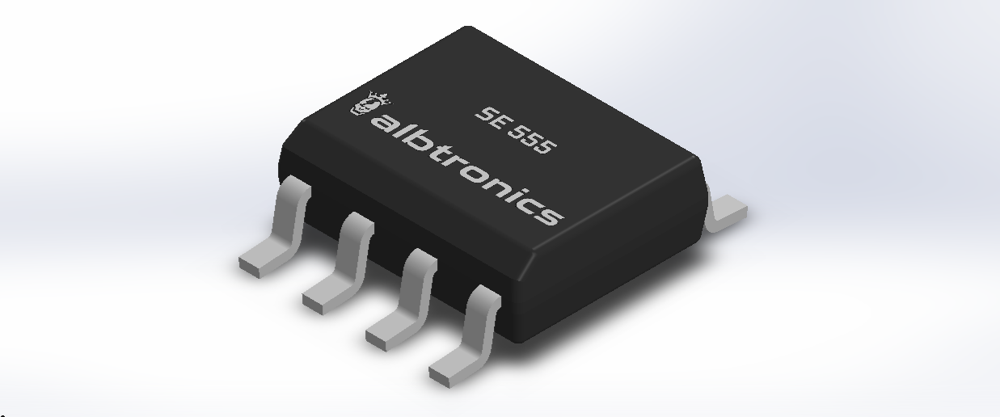
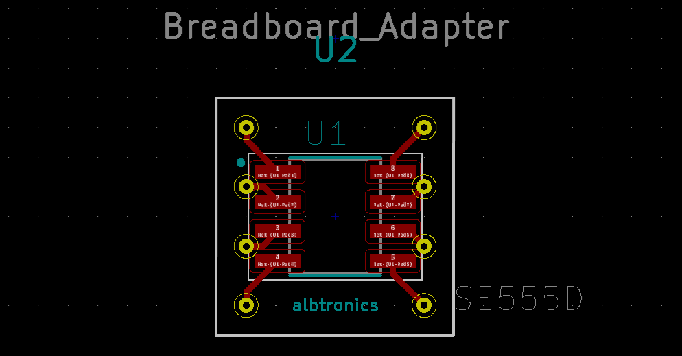
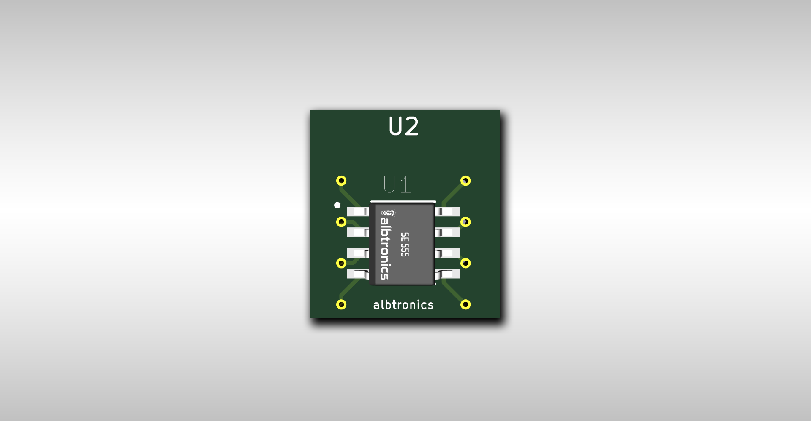

**# SOIC8_DIP_SMT_Adapter**

**SE555 3D Model**

**Breadboard Adapter Footprint**

**KiCad 3D Viewer**

## Import Steps for Kicad 5.1
* In KiCad, go to **Tools** > **Edit Schematic Symbols**.
* Click on **Preferences** > **Manage Footprint Libraries**.
* In the Global Libraries tab, click on **Add existing library to table**, the **small folder icon** and navigate to the downloaded _.lib_ file. Then click **Open**.
* Use the search bar on the left pane of the window to search for the imported symbol and double-click it to open.
